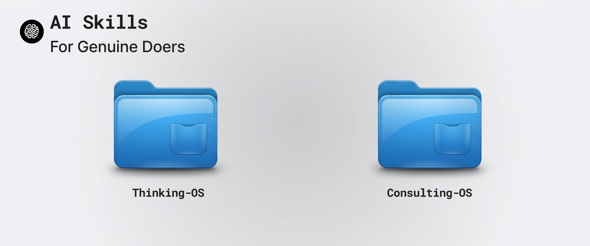

<p align="center">
  
</p>

# Skills For Genuine Doers

My second-brain skills that I use every day to do real work - not just vibing.

Context switching is hard, especially when you're a solopreneur juggling projects and clients. Approaches like MECE, TODOs, PARA, GTD and OKRs try to help you organise your thoughts. But while doing so, they take away the freedom to be creative and authentic.

These skills are designed to be small, easy to adapt, and composable. They work with any model. They're based on decades of consulting and applied experiences. Hack around with them. Make them your own. Enjoy.

When the agent needs something specific from your memory - a past decision, a quote from a call, what you've actually shipped - it reaches into your Timeln second brain via MCP. Every answer cites a source. If memory has nothing, the skill says so plainly - never invents.

## Quickstart

```bash
npx skills@latest add timelnapp/skills
```

Then connect the hosted MCP — once per agent:

1. **[timeln.app/signup](https://timeln.app/signup)** — free, Google SSO, no credit card.
2. **Settings → API Tokens → Create**. Copy the `tln_...` token.
3. Add to your agent's MCP config (`~/.claude.json`, `~/.cursor/mcp.json`, etc.):

   ```json
   {
     "mcpServers": {
       "timeln": {
         "url": "https://timeln-mcp-production.up.railway.app/mcp",
         "headers": { "Authorization": "Bearer tln_YOUR_TOKEN_HERE" }
       }
     }
   }
   ```

4. Restart your agent. `/mcp` should list `timeln`.

## Why I built these

Two problems kept biting me. Two skill packs are how I stopped them.

### The agent fabricates instead of remembering

Ask any agent to "recall what you said about X" and watch it pattern-match its training data, then dress the answer up as your history. It sounds confident. It's wrong. Worse — you only catch it when the client does.

The fix isn't a better prompt. It's a real lookup against a real second brain, with hard rules: every claim cites a Timeln doc, "no record" is the correct answer when memory is empty, and there's no fallback to vibes.

That's **[thinking-os](./skills/thinking-os/)** — six recall skills, each built for one moment (mid-call, mid-pitch, Monday planning) with one output shape. Plus a local TTS engine for when you want to listen to what you found.

### The agent skips your mental model on real consulting work

Pursuing a client engagement isn't a single prompt. It's frame → architect → gates → acceptance → commercial → package → red-team → pursue, with a human checkpoint at every step. Off-the-shelf agents skip straight from "here's the transcript" to "here's the proposal".

That's **[consulting-os](./skills/consulting-os/)** — a solo-founder pursuit pipeline with mandatory checkpoints and a 2-loop revision cap. The memory skills from thinking-os run at every stage. One memory layer, never duplicated.

## Reference

### thinking-os

Memory & recall, grounded in Timeln MCP. Six recall skills, one TTS engine.

- **[timeln-find](./skills/thinking-os/timeln-find/SKILL.md)** — Open-ended search and synthesis over your memory. MECE gap analysis, PARA framework, optional D3 knowledge graph.
- **[timeln-plan](./skills/thinking-os/timeln-plan/SKILL.md)** — Recent saves → ranked action plan via a 6-framework cascade (PARA → MECE → RICE → Eisenhower → GTD → 4DX). HTML pipeline, every filter decision visible.
- **[timeln-quickly](./skills/thinking-os/timeln-quickly/SKILL.md)** — One-breath mid-call recall. One sentence or one verbatim quote, one citation, under a second. No synthesis.
- **[timeln-shipped](./skills/thinking-os/timeln-shipped/SKILL.md)** — Proof of actually-shipped work with artifact pointers (repo, doc, demo link) ready to paste mid-pitch. Filters out saved articles.
- **[timeln-decided](./skills/thinking-os/timeln-decided/SKILL.md)** — Past decisions with stated rationale and rejected alternatives. Stops the agent from relitigating settled calls with generic tradeoff lectures.
- **[timeln-warned](./skills/thinking-os/timeln-warned/SKILL.md)** — Past failures, retros, post-mortems. Your actual scars, not "common pitfalls."
- **[timeln-podcast](./skills/thinking-os/timeln-podcast/SKILL.md)** — Generate podcast-quality narration from any text using local Kokoro TTS. Runs entirely offline — no API, no token.

### consulting-os

Solo-founder consulting pursuit pipeline. Human-in-the-loop gates at every stage.

- **[consult-pipeline](./skills/consulting-os/consult-pipeline/SKILL.md)** — Orchestrates the full workflow (CAPTURE → SUMMARY) with mandatory checkpoints and a 2-loop revision cap. Owns the prospect template and engagement passport schema.
- **[consult-frame](./skills/consulting-os/consult-frame/SKILL.md)** — Brief or transcript → structured engagement frame: decision, definition of good, scope, stakeholders.
- **[consult-arc](./skills/consulting-os/consult-arc/SKILL.md)** — Solution arc as a 3-option spread. Owns the framework-variants rubric reused by build + red-team.
- **[consult-gates](./skills/consulting-os/consult-gates/SKILL.md)** — Phasing and stage gates with exit criteria you can defend to a client.
- **[consult-acceptance](./skills/consulting-os/consult-acceptance/SKILL.md)** — Acceptance matrix with fallback rows fed by `timeln-warned` — your real scars, not invented risk theatre.
- **[consult-commercial](./skills/consulting-os/consult-commercial/SKILL.md)** — Commercial section: duration, team shape, fees, access assumptions. No invented numbers.
- **[consult-package](./skills/consulting-os/consult-package/SKILL.md)** — Assemble the client-ready proposal pack.
- **[consult-integrity](./skills/consulting-os/consult-integrity/SKILL.md)** — Gate 3.5 / 5.5 integrity check: citations, proof, scope lock, option drift, fabrication. Blocks the pipeline when it fails.
- **[consult-consistency-lint](./skills/consulting-os/consult-consistency-lint/SKILL.md)** — Cross-artifact lint (frame ↔ arc ↔ acceptance ↔ commercial). One primary decision thread, all the way through.
- **[consult-red-team](./skills/consulting-os/consult-red-team/SKILL.md)** — Multi-perspective stress test: exec, procurement, technical skeptic, devil's advocate. Severity-scored, not vibes-scored.
- **[consult-pursue](./skills/consulting-os/consult-pursue/SKILL.md)** — Cover email + 30-min call script + objection stubs. Cold-start mode synthesises a full pack from a client name and topic alone — useful when there's no brief on file yet.

Slash commands (one per pipeline stage): `/cos-plan`, `/cos-research`, `/cos-frame`, `/cos-design`, `/cos-integrity`, `/cos-architect`, `/cos-variants`, `/cos-lint`, `/cos-ship`, `/cos-pursue`, `/cos-resume`. Defined in [`.claude-plugin/commands/`](.claude-plugin/commands/).

## Install per agent

`npx skills@latest add timelnapp/skills` covers Claude Code, Cursor, Codex CLI, OpenCode, and GitHub Copilot CLI. Skills auto-discover from each agent's skills directory. If you use more than one agent, install separately for each.

- **Claude Code** — `/plugin install timeln-skills@timeln-skills`
- **Cursor** — `/add-plugin timeln-skills` in agent chat
- **Gemini CLI** — `gemini extensions install https://github.com/Timelnapp/skills`
- **Codex App** — Plugins sidebar → Productivity → Timeln Skills → +
- **OpenCode** — see [.opencode/INSTALL.md](.opencode/INSTALL.md)

## A note on philosophy

Every skill in this repo treats fabrication as a trust violation, not a quality issue. If your memory doesn't have the answer, the skill says so. No "based on what you might have said." No filler. The whole point of grounding an agent in your real history is that the answers stop sounding plausible and start being true.

The skills are MIT. Fork them. Edit them. Ship better ones. Tell me what broke.

## License

MIT — see [LICENSE](LICENSE).
